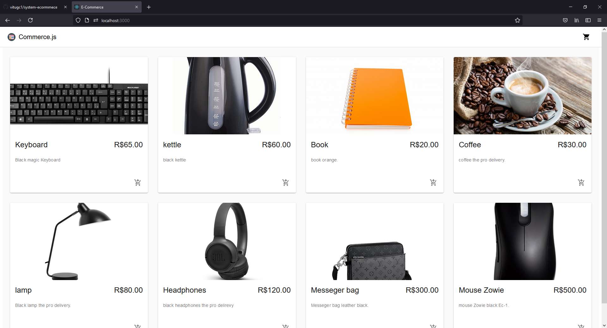

                             PROJETO EM ANDAMENTO
# COMO RODAR O PROJETO
Só precisa instalar o "YARN" ou "NPM", pelo terminal do VSCODE vc pode fazer isso.
Abra o terminal do VSCODE e digite YARN e espere instalar, depos que estiver instalado e só digitar YARN START é esperar carregar o projeto

# SOBRE O PROJETO
É um pequeno projeto de e-commerce só para testar minhas habilidades e brincar um pouco, usei uma API
externa para extrair as informações do site commerce.com com a autorização da instituição.

# TECNOLOGIAS USADAS
HTML
CSS
SASS
JAVASCRIPT
MATERIAL-UI

# IMAGEM DO PROJETO   

                        

